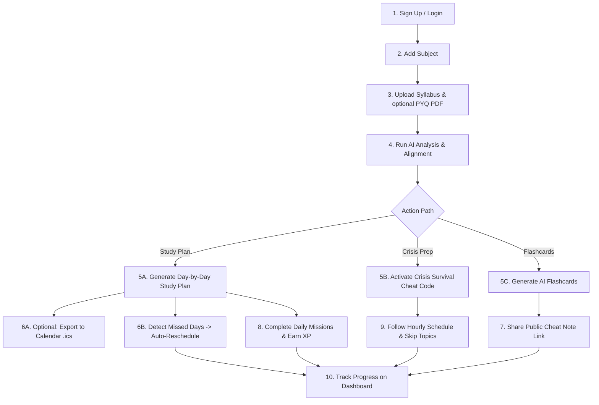

# Smart Syllabus Planner — Features & Workflow Documentation

Welcome to the **Smart Syllabus Planner (SSP)** project! This application is designed to help students optimize their exam preparation by transforming dense, chaotic syllabus sheets into organized, day-by-day roadmaps, actionable study tasks, and survival timeline strategies powered by Google Gemini AI.

---

## 📖 Table of Contents
1. [Detailed Features List](#-detailed-features-list)
2. [Features Summary (Table)](#-features-summary-table)
3. [Step-by-Step User Workflow](#-step-by-step-user-workflow)
4. [Tech Stack & Architecture](#-tech-stack--architecture)

---

## 🛠️ Detailed Features List

### 1. Secure Authentication & Dynamic User Profile
* **Registration & Sign Up:** Allows students to create accounts using their name, email, password, and optionally their **College / University**. During signup, they can select a custom target academic goal:
  * **Pass:** Focuses on passing threshold content (40%+ weightage).
  * **Good:** Balanced prep targeting standard grading (65%+ weightage).
  * **Excellent:** In-depth topper-focused coverage (85%+ weightage).
* **JWT-Based Login:** Protects private endpoints and secures client sessions.
* **Student profile dashboard:** Allows students to edit credentials, modify their target study goals, update their College / University, and manage basic settings.

### 2. Subject Management Hub
* **Subject Listing & Creation:** Students can manage individual cards for subjects. Each subject records details such as credit weight, code, exam date, and a custom theme color.
* **Overall Subject Progress:** An integrated progress bar displays how many topics have been completed for each subject out of the total parsed count.
* **Clean Deletion:** Deleting a subject recursively cleans up its parsed syllabus, active study plans, and daily missions.

### 3. AI-Powered Syllabus Analysis
* **Multiple Import Channels:** Students can upload a **PDF syllabus file**, an **image snapshot** (JPG, PNG, WEBP), or paste **raw text syllabus content**.
* **Text Extraction:** Uses the `pdf-parse` library on the Node.js backend to extract text.
* **Gemini AI Integration:** Utilizes Google Gemini's `gemini-1.5-flash` model with `responseMimeType: "application/json"` (and incorporates their registered College/University context to optimize study recommendations based on specific institutional patterns) to generate structured data containing:
  * **Units & Topics:** Nested list mapping importance levels (`critical`, `high`, `medium`, `low`), difficulty levels (`easy`, `medium`, `hard`), estimated study hours, weightage marks, and clear topic-focus tips.
  * **Top Priority Topics:** Focus subjects recommended for immediate study.
  * **Exam-Likely Topics:** High probability questions prediction.
  * **Overall Difficulty:** Dynamic classification (`easy`, `medium`, `hard`, `very-hard`).
  * **Study Tips & Strategy:** General tips tailored for the subject.
* **Topic Progress Tracking:** Checkboxes beside each parsed topic allow students to complete them, updating progress rings in real time.
* **Resilience & Graceful Degradation:** The AI analysis and planning engines are designed to gracefully degrade. If the Gemini API key is missing or calls fail/rate-limit, the system returns mock syllabus structures so the application remains fully usable.

### 4. Smart Study Planner (Normal Mode)
* **Tailored Schedule Generation:** Takes exam date, daily available study hours, and target goal as inputs.
* **Day-by-Day Roadmap:** Distributes the topics across the remaining days up to the exam date (capped at 30 days max for standard planning). 
* **Dynamic Content:** Each study day includes:
  * Specific daily topics to read.
  * Estimated hours required for that day.
  * Personalized study/mental health tips.
* **Day Completion Checkpoints:** Checkboxes to log completion of entire days of study.

### 5. Crisis Mode: Exam Survival "Cheat Codes"
* **Timeline Presets:** For scenarios where exams are extremely near (1 Day, 3 Days, 7 Days, 15 Days, or Custom timeline).
* **"Must Study Now" Priorities:** Recommends critical topics, explaining exactly *why* they are essential, their estimated marks weightage, and study duration.
* **"Skip (For Now)" Checklist:** Safe-to-bypass, low-weightage topics to maximize efficiency when time is short.
* **Hourly Schedule:** Generates an hour-by-hour timeline plan for today.
* **Score Simulator:** Predicts expected score brackets (Minimum, Expected, and Best Case).

### 6. Gamification, Leveling & Streaks
* **Study & Revision Missions:** Study plans dynamically generate daily tasks including Study Sessions, Spaced Revision, and End-of-Day Summaries.
* **Dynamic XP Engine:** Completing tasks rewards the student with XP. The backend tracks experience progression and triggers level-ups dynamically using the `level * 250` progression curve.
* **Daily Streaks:** Monitors consecutive active days of study via the database. Streaks increment on consecutive daily activity, persist if active today, and automatically reset to `0` on the dashboard if a calendar day is missed.
* **Dynamic Badges:** Displays interactive level progression bars and streak badges on the student's Dashboard and Profile page.

### 7. Notification Center
* Keeps users informed on plan creations, exam countdown milestones, and system updates.
* Interface to read and clean up alerts.

### 8. Premium Central Dashboard
* **Readiness Meter:** Visual ring showing the user's average progress across subjects.
* **Smart Recommendations:** Recommends the next critical step (e.g., "Add Subject", "Upload Syllabus", "Generate Plan", or "Review Cheat Code").
* **Revision Radar:** Lists subjects displaying $<30\%$ progress with upcoming exams.

### 9. PYQ Analysis & Exam Alignment (Triple Topic Output)
* **Past Paper Integration:** Students can upload a PDF containing previous year question papers alongside the syllabus.
* **Evidence-Based Insights:** The system parses exam questions and provides a detailed triple-alignment topic breakdown:
  * **Overlap Topics:** Topics appearing in both the syllabus AI analysis and past papers (highest priority).
  * **PYQ-Only Topics:** Topics seen in past papers but missing from the parsed syllabus (potential study gaps).
  * **AI-Only Topics:** Syllabus topics that have never appeared in exam questions (lower priority).
* **Topic Frequency & Marks:** Displays how often a topic was tested, specific exam years, and estimated marks weightage.

### 10. Study Calendar Export (.ics)
* **Cross-Platform Compatibility:** Allows exporting personalized study plans to Google Calendar, Apple Calendar, Outlook, and other standard calendar clients.
* **iCalendar Protocol:** Generates a custom `.ics` file containing structured calendar events (VEVENTs) representing the day's subjects, study tasks, and exam dates.

### 11. Auto-Rescheduling of Missed Days
* **No-Guilt Recovery:** Detects past study days that were not completed.
* **Smart Redistribution:** Dynamically redistributes topics from missed days across remaining uncompleted days in the plan, recalculating daily study hour averages.
* **System Warning Alerts:** Displays a session banner highlighting missed days, and marks rescheduled day cards with a clean warning indicator.

### 12. Interactive AI Flashcards & Shareable Cheat Notes
* **AI Card Generation:** Automatically compiles concise study flashcards for critical and high-importance syllabus topics.
* **3D Swiper UI:** Premium flip card swiper styled with CSS 3D transforms, allowing students to study questions and flip cards interactively. Includes keyboard navigators (Arrow keys and Spacebar).
* **Public Cheat Notes:** Enables one-click link generation. Students can publish their flashcards as public, unauthenticated study guides with custom titles and a viral loop footer.

---

## 📋 Features Summary (Table)

| Feature Category | Feature Name | Description | Key Tech / APIs Used |
| :--- | :--- | :--- | :--- |
| **User Space** | Authentication | Signup, Login, Profile, and Auth state management. Includes College/University context. | JWT, BcryptJS, Express, React Context |
| | Goal Settings | Select academic target goals (`pass`, `good`, `excellent`) and College/University field. | MongoDB User Schema, React State |
| **Subjects** | Subject Manager | Register, update, and manage subjects. | Express Router, Mongoose |
| | Progress Ring | Shows subject completion based on completed topics. | SVG ProgressRing, CSS transitions |
| **Syllabus** | Multi-uploader | Import syllabus via PDF, Image, or plain text. | Multer, PDF-Parse, Express |
| | AI Parser | Generates detailed topics list, hours estimate, difficulty levels. | Google Gemini AI (`gemini-1.5-flash`) |
| | Topic Checklist | Mark topics completed to raise subject progress. | Mongoose Nested Schemas, React |
| **Syllabus / PYQ** | PYQ Alignment | Cross-reference past papers to output Overlap, PYQ-Only, and AI-Only topic divisions. | Multer, PDF-Parse, Gemini AI |
| **Planner** | Normal Planner | AI day-by-day roadmap fitting remaining timeline. | Google Gemini AI, date-fns |
| | Day Checklist | Progress bar marking days of the study plan complete. | MongoDB StudyPlan Schema |
| | Calendar Export | Export study plans as `.ics` files for Google, Apple, and Outlook calendars. | String VEVENT compiler, Express |
| | Auto-Rescheduling | Automatically redistributes missed topics across remaining uncompleted study days. | Mongoose, React State, custom algorithm |
| **Flashcards** | Swiper Viewer | Generated 3D flip card viewer for critical/high priority topics with filters. | CSS 3D Transforms, Keyboard Events |
| | Cheat Note Sharing | Generate secure public share links to read study sheets without signing up. | Mongoose, crypto tokens, React |
| **Cheat Code** | Crisis Planner | Timeline presets (1d, 3d, 7d) for emergency study. | Google Gemini AI |
| | Topic Offloader | Suggests topics to skip entirely to optimize time. | Mongoose & Gemini AI |
| **Gamification** | Mission Creator | Generates study, revision, and summary daily tasks. | MongoDB Mission Schema |
| | XP Engine & Streak | Updates user level, dynamically rewards XP, and tracks consecutive daily streaks. | Mongoose (User model), Express, React |
| **Alerts** | Notification System | Alerts for exam warnings and system confirmations. | MongoDB Notification Schema |
| **Dashboard** | Unified Command | Displays countdowns, stats, recommendations, & warnings. | Aggregated API Controller |

---

## 🧭 Step-by-Step User Workflow

### Step 1: Authentication
1. Go to the landing page and click **Get Started**.
2. Sign up to create a student profile and select your academic target goal (e.g., *Good*).
3. Access your secure session and proceed to the central command dashboard.

### Step 2: Subject Registration
1. In the Subjects panel, click **Add Subject**.
2. Enter your subject parameters: Name (e.g. *Operating Systems*), Code (*CS302*), select a card color, credit hours, and exam date, then click **Save**.

### Step 3: Syllabus & Past Papers Upload & Analysis
1. Select the new subject card and navigate to the **Syllabus** tab.
2. Select your preferred import method:
   * **PDF:** Upload a digital file.
   * **Image:** Upload a screenshot.
   * **Text:** Paste plaintext details.
3. Click **Run AI Analysis**. Gemini AI will parse the syllabus and render unit breakdowns, estimated hours, difficulty badges, and study strategy tips.
4. **Optional (PYQ Upload):** Upload previous year question paper PDFs in the **PYQ Alignment** panel. The system automatically cross-references these papers against syllabus topics to identify top overlap priorities and gaps.

### Step 4: Study Plan Generation & Exporting
1. Click the **Planner** tab.
2. The exam date will auto-populate. Adjust the range slider for **Study Hours Per Day** and set your **Target Goal**.
3. Click **Generate AI Plan**. Gemini will formulate a study roadmap mapping topics to daily time slots and generate corresponding study and revision tasks.
4. **Export to Calendar:** Click **Export to Calendar** to download an `.ics` file and import your entire exam schedule into Google Calendar, Outlook, or Apple Calendar.

### Step 5: Study Execution, Gamification & Rescheduling
1. Open the **Dashboard** or **Missions** page to check today's tasks.
2. Work through the daily topics. Once a study or revision session is completed, check the checkbox next to the mission.
3. You will receive a success popup, earn XP points, progress towards leveling up, and increase your daily streak.
4. **Auto-Reschedule:** If you miss any days of study, a banner will appear offering to redistribute missed topics. Click **Reschedule Now** to redistribute them across remaining days.

### Step 6: Interactive Review & Sharing Cheat Notes
1. Navigate back to the **Syllabus** tab and locate the **Flashcards** section.
2. Click **Generate Flashcards** to build a high-yield interactive card set for critical and high importance topics.
3. Navigate the deck using Arrow keys and spacebar, or flip/swipe them on screen.
4. Input a custom title and click **Generate Share Link** to publish your card set publicly. Send the link to friends so they can access a read-only list without needing an account.

### Step 7: Crisis Management (Last-minute Prep)
1. If the exam is tomorrow, go to the **Cheat Code** tab.
2. Select the **1 Day** or **3 Days** preset mode, set your active study capacity, and click **Activate Cheat Code**.
3. The planner will instantly update your view, highlighting critical topics, providing an hourly timeline, and identifying items to skip to save time.

---

## 💻 Tech Stack & Architecture

### Backend (Express API Server)
* **Core:** Node.js, Express.js
* **Database:** MongoDB, Mongoose (schemas for Users, Subjects, Syllabuses, Plans, Missions, Notifications, and FlashcardSets)
* **AI Engine:** Google Gemini SDK (`@google/generative-ai`)
* **Libraries:** `pdf-parse` (text extraction), `bcryptjs` (passwords), `jsonwebtoken` (auth), `multer` (uploads)

### Frontend (React Single Page App)
* **Core:** React (Vite environment), React Router DOM (protected route layout)
* **State & Context:** React Hooks, Auth Context, Notification Context, Theme Context
* **UI/CSS:** Vanilla CSS styled with premium glassmorphism, responsive grids, custom CSS variables, keyframe animations, and 3D perspectives/transforms.
* **Libraries:** `date-fns` (date management), `react-hot-toast` (dynamic feedback alerts)
